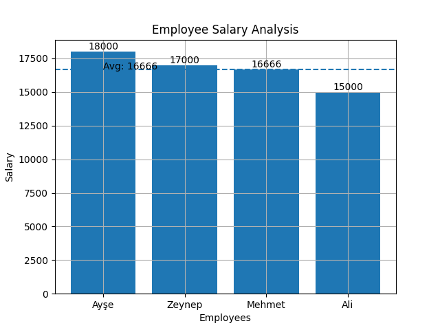

# 📊 JSON Data Analysis Project

This project demonstrates basic data analysis and visualization using Python.

## 🚀 Features
- Read JSON data
- Handle missing values
- Data cleaning
- Salary analysis
- Data visualization with matplotlib

## 🛠️ Technologies
- Python
- Pandas
- Matplotlib

## 📈 Output



## 📂 Project Structure
- data.json → raw data
- main.py → analysis script
- salary_chart.png → generated chart

## ▶️ How to Run

```bash
pip install pandas matplotlib
python main.py